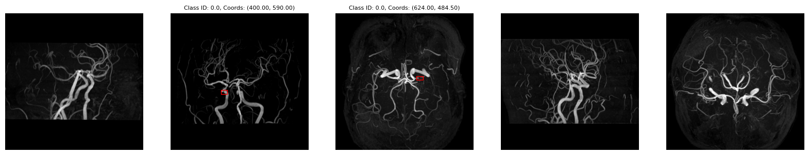
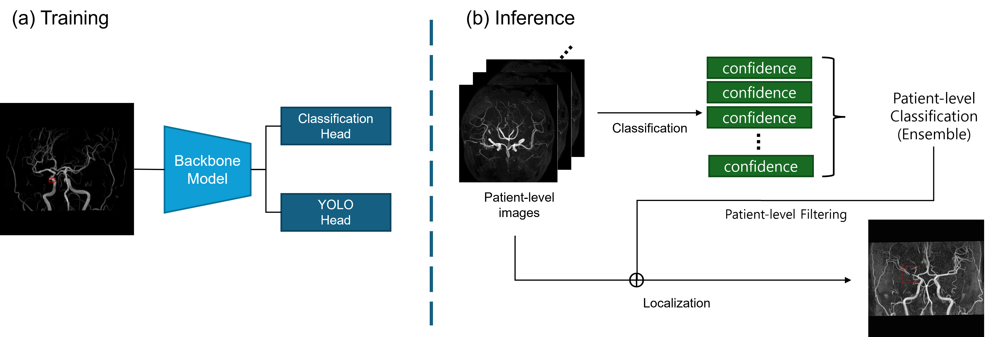
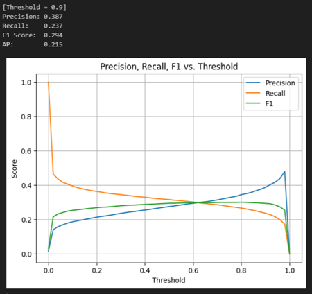

---
# TOF MRA 기반 뇌 협착 탐지 프로젝트

## 🧠 개요

본 프로젝트는 **Time-of-Flight Magnetic Resonance Angiography (TOF MRA)** 이미지를 활용하여 뇌 혈관 협착을 **자동으로 분류하고 탐지**하는 딥러닝 솔루션입니다. 뇌졸중의 주요 원인인 뇌 협착을 조기에 정확히 진단하여 임상 진단을 돕는 것을 목표로 합니다.

---

## 📊 데이터셋 (Dataset)

저희는 두 종류의 데이터를 활용했습니다:

* **내부 데이터:** HF(Head-Feet)/RL(Right-Left) 회전 방향별로 각각 19장씩, **총 38장의 이미지**를 사용했습니다.
* **외부 데이터:** HF/RL 회전 방향별로 각각 13장씩, **총 26장의 이미지**를 활용했습니다.

위 이미지는 TOF MRA 데이터셋의 예시입니다.

---

## 🚀 방법론 (Method)

---

## 📈 성능 (Performance)

**환자 레벨(Patient-level) 분류 성능:** 환자 전체를 기준으로 협착 유무를 분류한 성능 지표입니다.

**이미지 레벨(Image-level) 협착 위치 특정 성능:** MRA 이미지 내 협착 부위의 정확한 위치를 찾아낸 성능 지표입니다.
